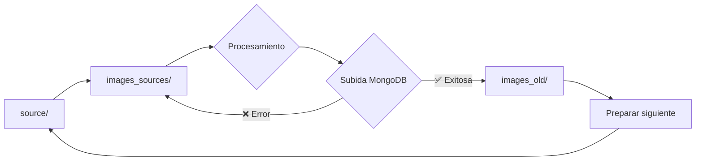

# 🔒 MEJORAS DE SEGURIDAD EN EL PROCESAMIENTO DE IMÁGENES

## Fecha: $(date '+%Y-%m-%d %H:%M:%S')
## Archivos modificados: web_app.py

---

## 🎯 PROBLEMA RESUELTO

**ANTES**: Las imágenes se movían de `images_sources` a `images_old` inmediatamente después del procesamiento, ANTES de confirmar que se subieron exitosamente a MongoDB. Esto creaba un riesgo de pérdida de datos si fallaba la subida.

**AHORA**: Las imágenes permanecen en `images_sources` hasta confirmar que la subida a MongoDB fue exitosa, garantizando que no se pierda el rastro de ninguna imagen.

---

## 🔄 CAMBIOS REALIZADOS

### 1. **Función `process_image_automated()` - MODIFICADA**

**Cambios principales:**
- ❌ **REMOVIDO**: Movimiento automático de imagen a `images_old` 
- ❌ **REMOVIDO**: Preparación automática de siguiente imagen
- ✅ **AGREGADO**: Mensaje indicando que la imagen espera subida a MongoDB
- ✅ **AGREGADO**: Campo `awaiting_upload: true` en respuesta
- ✅ **MEJORADO**: Mensaje de estado más claro

**Flujo anterior:**
```
Procesar → Mover a images_old → Preparar siguiente → [Subir a MongoDB]
```

**Flujo nuevo (SEGURO):**
```
Procesar → [Esperar en images_sources] → [Subir a MongoDB] → Mover a images_old → Preparar siguiente
```

### 2. **Función `process_final()` - COMPLETAMENTE REESCRITA**

**Nuevas características:**
- 🔒 **PROTECCIÓN**: Solo mueve imagen después de subida exitosa
- 🛡️ **MANEJO DE ERRORES**: Si falla MongoDB, imagen permanece segura
- 📊 **TRACKING**: Registra el nombre de imagen antes de procesar
- 🔄 **GESTIÓN COMPLETA**: Maneja el flujo completo de archivado
- 📈 **REPORTING**: Proporciona estado detallado del proceso

**Código nuevo implementado:**
```python
def final_process_thread():
    try:
        # 1. Obtener imagen actual ANTES de procesar
        current_image_path = get_image_from_sources()
        current_image_name = os.path.basename(current_image_path) if current_image_path else "desconocida"
        
        # 2. Subir a MongoDB
        pair_and_upload_codes_images_by_order(...)
        
        # 3. SOLO si subida exitosa → mover imagen
        if current_image_path and move_processed_image_to_old(current_image_path):
            # 4. Preparar siguiente imagen
            has_next = move_next_image_to_sources()
            
    except Exception as e:
        # Si falla MongoDB → imagen permanece segura en images_sources
        send_progress("📋 Imagen permanece en images_sources por seguridad")
```

### 3. **NUEVAS FUNCIONES AGREGADAS**

#### a) **`/processing_status` - Endpoint de estado**
```python
@app.route('/processing_status')
def processing_status():
    """Verifica el estado del procesamiento actual"""
```
**Proporciona:**
- ✅ Si hay imagen actual en procesamiento
- ✅ Nombre de imagen actual
- ✅ Cantidad de archivos procesados pendientes de subir
- ✅ Estado del sistema completo

#### b) **`/force_archive_image` - Archivado manual de emergencia**
```python
@app.route('/force_archive_image', methods=['POST'])
def force_archive_image():
    """Mueve manualmente la imagen actual a images_old (usar con precaución)"""
```
**Características:**
- ⚠️ **USO DE EMERGENCIA**: Para casos excepcionales
- 🔒 **SEGURIDAD**: Solo si existe imagen en images_sources
- 🔄 **COMPLETO**: Incluye preparación de siguiente imagen

---

## 🛡️ BENEFICIOS DE SEGURIDAD

### ✅ **Protección contra pérdida de datos**
- Las imágenes no se pierden si falla la conexión a MongoDB
- Siempre hay una copia en `images_sources` hasta confirmar subida

### ✅ **Trazabilidad completa**
- Se registra qué imagen se está procesando
- Se confirma qué imagen se archivó exitosamente
- Se proporciona estado detallado en cada paso

### ✅ **Recuperación ante errores**
- Si falla MongoDB, el proceso se puede reintentar
- La imagen permanece disponible para reprocesamiento
- No se pierde el lugar en la cola de procesamiento

### ✅ **Monitoreo mejorado**
- Nuevo endpoint `/processing_status` para verificar estado
- Mensajes de progreso más detallados
- Información clara sobre qué está esperando subida

---

## 📁 NUEVO FLUJO DE DIRECTORIOS



**Estados de la imagen:**
1. **📁 source/**: Esperando ser procesada
2. **🔄 images_sources/**: En procesamiento o esperando subida
3. **✅ images_old/**: Procesada y subida exitosamente a MongoDB

---

## 🔧 CÓMO USAR LAS NUEVAS FUNCIONES

### **Verificar estado actual:**
```bash
curl http://localhost:5000/processing_status
```

### **Forzar archivado manual (emergencia):**
```bash
curl -X POST http://localhost:5000/force_archive_image
```

### **Proceso normal (sin cambios para el usuario):**
1. Poner imágenes en `source/`
2. Usar `/process_auto` para procesar
3. Usar `/process_final` para subir a MongoDB
4. ✅ La imagen se archiva automáticamente tras subida exitosa

---

## 📋 ARCHIVOS DE RESPALDO

- **Backup creado**: `web_app_original_backup.py`
- **Para revertir cambios**: `cp web_app_original_backup.py web_app.py`

---

## 🚀 MEJORAS FUTURAS SUGERIDAS

1. **Base de datos de estado**: Registrar estado de cada imagen en DB
2. **Reintento automático**: Si falla MongoDB, reintentar automáticamente
3. **Notificaciones**: Alertas por email/Slack cuando falla subida
4. **Dashboard web**: Interfaz para monitorear estado de todas las imágenes
5. **Logs estructurados**: Logging JSON para mejor análisis

---

## ⚠️ NOTAS IMPORTANTES

- **COMPATIBILIDAD**: Todas las funciones existentes siguen funcionando
- **SIN BREAKING CHANGES**: El frontend no necesita modificaciones
- **MEJORA TRANSPARENTE**: Los usuarios no notarán diferencias en el uso normal
- **SOLO MEJORA SEGURIDAD**: Únicamente agrega protección sin cambiar funcionalidad

---

## 🧪 TESTING RECOMENDADO

1. **Probar flujo normal**: Procesar imagen → Subir a MongoDB → Verificar archivado
2. **Probar con error de MongoDB**: Desconectar MongoDB → Verificar que imagen no se mueve
3. **Probar endpoint de estado**: Verificar `/processing_status` en diferentes estados
4. **Probar archivado manual**: Usar `/force_archive_image` en caso de emergencia

---

**✅ IMPLEMENTACIÓN COMPLETADA EXITOSAMENTE**
